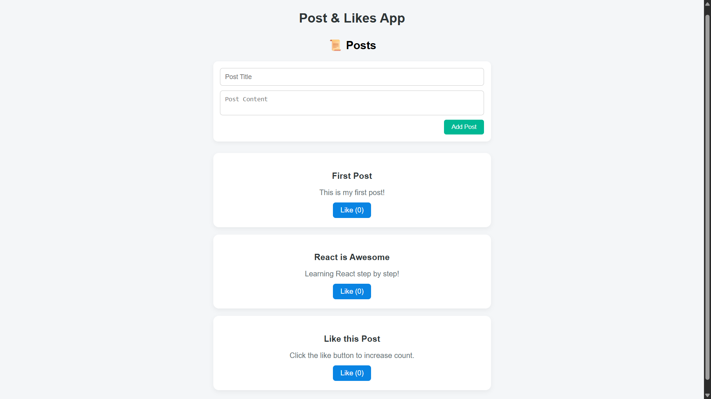

# ⚛️ Post & Likes App

This is a **mini-project** built as part of the  
**[UI Developer Training Program](https://github.com/MylapalliYesebu/UI-Developer-Training-Projects.git)** (Phase 2),  
a CSR initiative of **Infosys Foundation** at **Ideal Institute of Technology**.

---

## 📋 Description

The **Post & Likes App** is a simple **ReactJS** application designed to demonstrate key **React concepts** like **state management**, **props**, and **real-time UI updates**.

In this app, users can view multiple posts and click the **Like** button to increase the like count instantly. The app updates the UI dynamically without reloading, showing how **React state** and **component-based design** work together efficiently.

An extra feature allows users to add their own posts, which appear immediately in the list — showcasing how React handles user input and component re-rendering.

---

## 🛠️ Tech Stack

* **ReactJS** – Component-based front-end framework
* **JavaScript (ES6)** – Application logic and interactivity
* **CSS** – Styling and responsive layout
* **HTML (JSX)** – UI structure within React components

---

## 🎯 Features

✅ View a list of posts dynamically  
✅ Like any post to increase its count in real time  
✅ Add new posts with title and content  
✅ Modern, responsive UI with hover effects  
✅ Smooth React state updates without reloading  

---

## 🧠 Learning Objectives

This project helped me understand:

* Setting up a React app using `create-react-app`
* Using **useState Hook** for managing dynamic data
* Passing data and functions through **props** between components
* Handling **user events** (button clicks, form submissions)
* Writing clean, reusable React components
* Styling components with modular and responsive CSS

---

## 📸 Screenshot

---

## 🧪 Live Demo

👉 [View the live demo](https://mylapalliyesebu.github.io/post-likes-app/)

---

## 🔗 Related Projects

This project is part of my full **UI Developer Training Project Series**:  
👉 [UI Developer Training Projects](https://github.com/MylapalliYesebu/UI-Developer-Training-Projects)

---

## 👤 Author

* **Mylapalli Yesebu**
* [GitHub](https://github.com/MylapalliYesebu)
* [Gmail](mailto:yesebumylapalli08@gmail.com)
